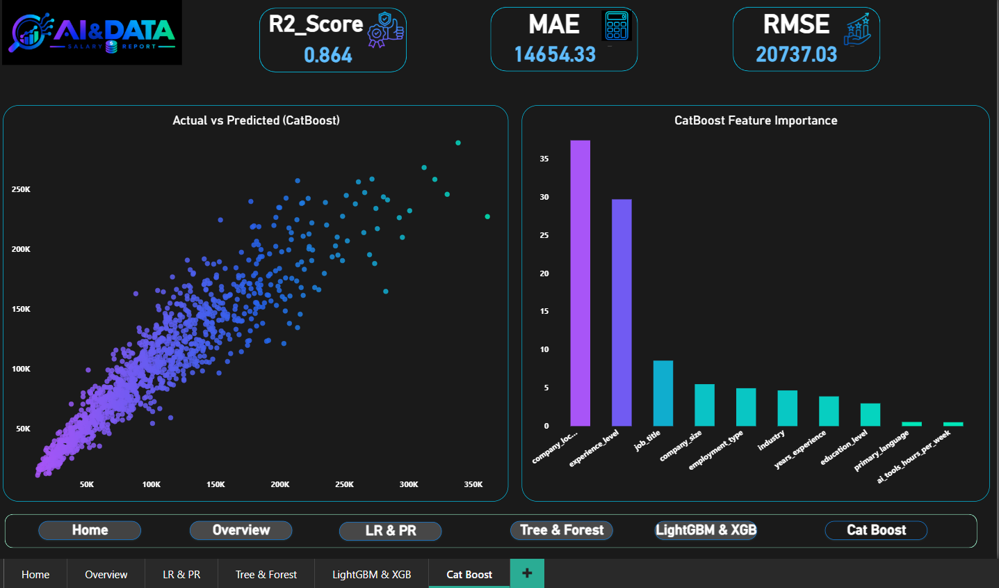
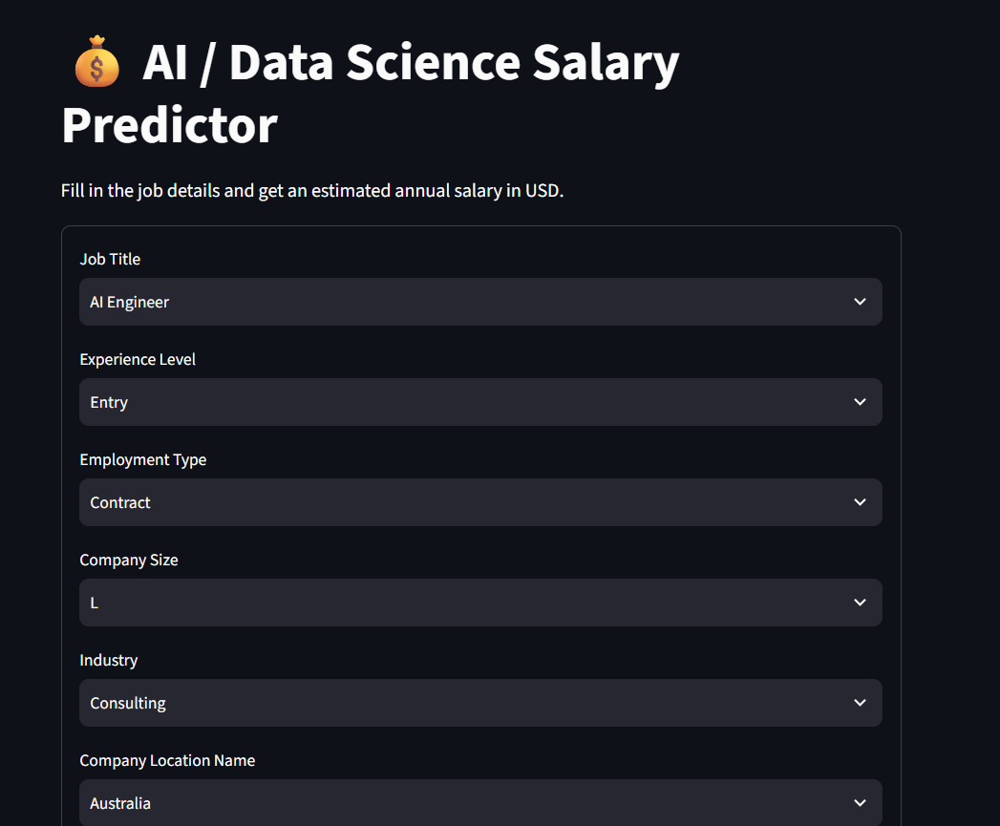
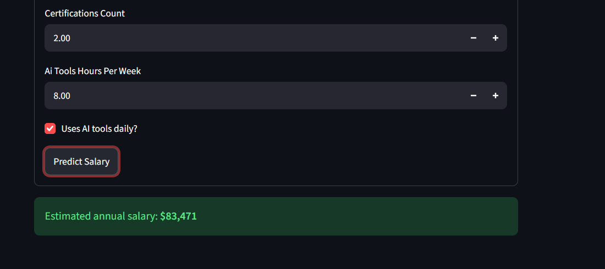

# Salary Prediction — Machine Learning Project

## 📌 Project Overview

This project builds and compares multiple **Machine Learning regression models** to predict employee salaries from a set of relevant features.

The workflow covers the complete ML pipeline:

**Raw Data → Data Cleaning → EDA → Model Training → Model Evaluation → Model Selection → Deployment**

The final selected model is **CatBoost**, based on its strong test performance and better generalization compared with the other evaluated models.

---

## 🚀 Project Highlights

- Data cleaning and preprocessing
- Exploratory Data Analysis (EDA)
- Feature selection and preparation
- Training and comparison of **7 regression models**
- Evaluation using **R² Score** and **RMSE**
- Selection of the best-performing model
- Deployment using **Streamlit**
- Interactive visualization using **Power BI**

---
## 📊 Model Comparison Results

| Model | R² (Train) | R² (Test) | MAE | RMSE |
|---|---|---|---|---|
| **CatBoost** ⭐ | 0.888 | **0.864** | 14,654 | 20,737 |
| LightGBM | 0.939 | 0.855 | 15,256 | 21,382 |
| XGBoost | 0.888 | 0.845 | 15,699 | 22,102 |
| Polynomial Regression | 0.821 | 0.810 | 18,273 | 24,520 |
| Linear Regression | 0.820 | 0.809 | 18,301 | 24,580 |
| Random Forest | 0.876 | 0.776 | 18,843 | 26,611 |
| Decision Tree | 0.681 | 0.649 | 23,671 | 33,297 |

### Why CatBoost?

CatBoost was selected as the final model because it achieved the **highest reported Test R² of 0.864** with an **RMSE of 20,737**.

Although LightGBM achieved a higher training R² (**0.939**), its test R² dropped to **0.855**, indicating a larger train/test gap. CatBoost achieved a smaller gap between training and testing performance, suggesting better generalization on unseen data.

---

## 📊 Power BI Dashboard

(`job_ai_project.pbix`)
A Power BI dashboard was created to visualize and compare the model predictions and evaluation results.

The dashboard can be used to compare:

- Actual vs. Predicted Salary
- Model performance
- R² Score
- Differences between models

### Dashboard Preview

```markdown

```

---

## 🖥️ Web Application

The selected model can be used through a **Streamlit web application**, where users can enter the required features and receive a predicted salary.

> **[Live Demo](https://salary-prediction-ml-project.streamlit.app/)**

### Web App Preview

```markdown


```

---

## 🛠️ Tech Stack

- Python
- Pandas
- NumPy
- Matplotlib
- Seaborn
- Scikit-learn
- CatBoost
- LightGBM
- Jupyter Notebook
- Streamlit
- Power BI
- Git & GitHub

---

## 📁 Repository Structure

```
NTI-Project---ModelX-AI-Team/
│
├── data/
│   ├── raw/
│   │   └── ai_ds_job_salaries_2026_raw.csv     # The raw dataset before cleaning
│   └── data cleaning/
│       ├── Data Cleaning Proccess.ipynb        # Cleaning and null handling
│       └── EDA.ipynb                           # Exploratory Data Analysis
│
├── ML Models/
│   ├── Salary_Prediction_Main_Notebook.ipynb   # Training & comparing all 7 models
│   └── BestModel_CatBoost.ipynb                # Final CatBoost model (tuning & export)
│
├── webapp/
│   ├── app.py                                  # Streamlit app source code
│   ├── catboost_model.cbm                      # Trained CatBoost model file
│   ├── model_metadata.json                     # Feature schema used by the app
│   ├── requirements.txt                        # Python dependencies
│   └── weblink.txt                             # Link to the deployed app
│
├── job_ai_project.pbix                       # Power BI dashboard (Comparing models' results)
└── README.md
```

---

## 🎯 Final Result

The project demonstrates a complete end-to-end regression workflow, from preparing the dataset and exploring the data to comparing several ML models and deploying the selected model.

**Best reported model:** CatBoost  
**Test R²:** 0.864  
**RMSE:** 20,737

The project combines **Machine Learning + Streamlit + Power BI** to turn the trained model into a practical salary-prediction solution.

---

## 👥 Team

This project was developed as part of the **NTI (National Telecommunication Institute)** training program by **Mohamed Elshafie**, **Mohamed Monyer** and **Omar Khaled** -- **Team ModelX AI**.
